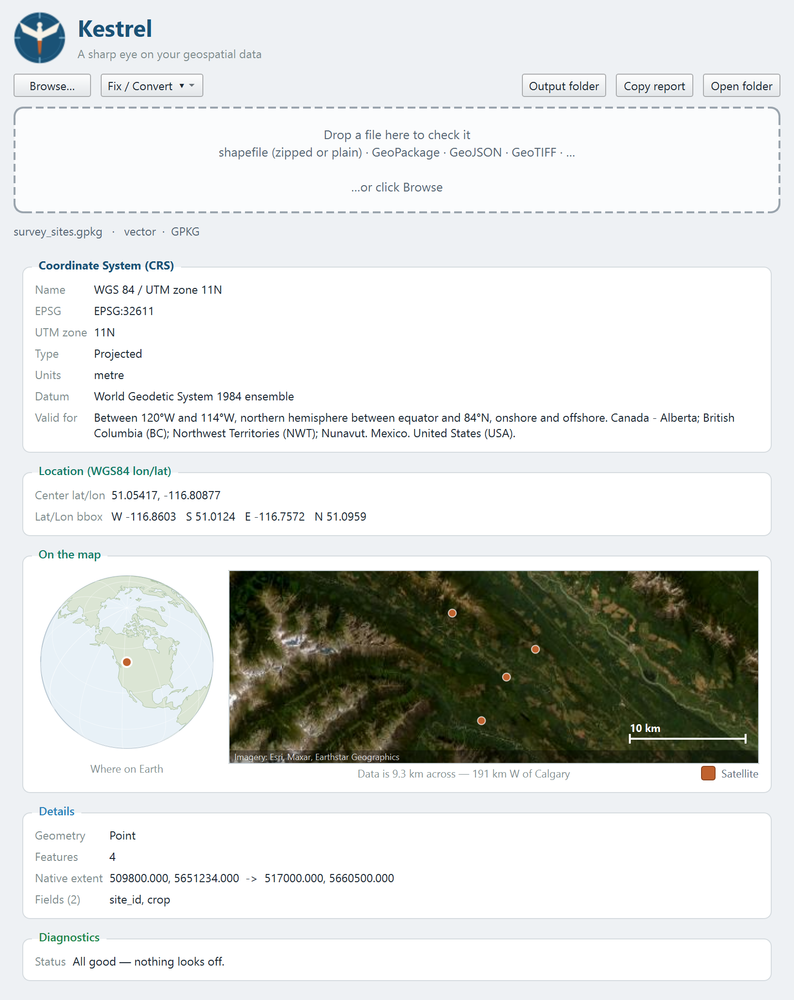

<div align="center">


# Kestrel

**A sharp eye on your geospatial data.**

</div>

A tiny Windows desktop app that gives you the **basic facts about a geospatial file** at a
glance — most importantly its **CRS / UTM zone** and its **real-world location** — plus a short
list of warnings explaining **why a layer might not be drawing correctly in QGIS**.

Built for the moment when you drag a file into QGIS and… nothing shows up. Drop it on Kestrel
first and find out why.

<div align="center">

</div>

## What it tells you

- **Format & driver** (Shapefile, GeoPackage, GeoJSON, GeoTIFF, …)
- **CRS** — name, EPSG code, **UTM zone**, projected vs. geographic, units, datum, and the
  region the CRS is valid for
- **Location (WGS84)** — the extent reprojected to lon/lat, so you can confirm the data lands
  where you expect on Earth
- **Details** — geometry type, feature count and fields (vector); size, bands, data type,
  pixel size and NoData (raster); native extent
- **Diagnostics** — common reasons a layer won't show up in QGIS:
  - No CRS defined / missing `.prj`
  - Coordinates that don't match the declared CRS (e.g. lat/lon tagged as a projected CRS —
    the classic "lands in the ocean")
  - Empty layers, zero-area extents, "Null Island" (0, 0) coordinates
  - Data sitting well outside the CRS's valid area
  - Multiple layers in a GeoPackage (you may be loading the wrong one)

## Supported inputs

Zipped or plain **shapefiles**, **GeoPackage** (`.gpkg`, multi-layer), **GeoJSON**, KML/GML/GPX,
and **rasters** via rasterio (**GeoTIFF**, IMG, VRT, JPEG2000, …). Unknown extensions are tried
as vector first, then raster, so most things just work.

## Getting it

### Download (recommended)

Grab **`Kestrel-windows.zip`** from the [**Releases**](../../releases) page (no Python
required), unzip it anywhere, and run **`Kestrel\Kestrel.exe`**. It's a one-folder build, so it
starts fast — about a second — with no unpacking step. (Windows may show a SmartScreen prompt
for the unsigned exe — choose *More info → Run anyway*.)

### Run from source

- **GUI:** double-click **`run.bat`**, or run `py gui.py`.
  (Right-click `run.bat` → *Send to → Desktop* to make a desktop shortcut.)
- **Command line:** `py cli.py path\to\data.gpkg` prints the same report in the terminal.

Needs Python 3.10+ and the packages in [`requirements.txt`](requirements.txt):

```
py -m pip install -r requirements.txt
```

### Build the .exe yourself

```
py -m pip install pyinstaller pyinstaller-hooks-contrib
build.bat          REM  ->  dist\Kestrel.exe
```

The build recipe lives in [`Kestrel.spec`](Kestrel.spec); it bundles the GDAL/PROJ data so the
exe is fully self-contained.

## Logo / branding

Drop your artwork into [`assets/`](assets/) and it's picked up automatically — no code changes:

- `assets/logo.png` → app header + README + window/taskbar icon
- `assets/icon.ico` → preferred Windows window/taskbar icon (takes priority)

## License

[MIT](LICENSE) © 2026 Dozer3530
